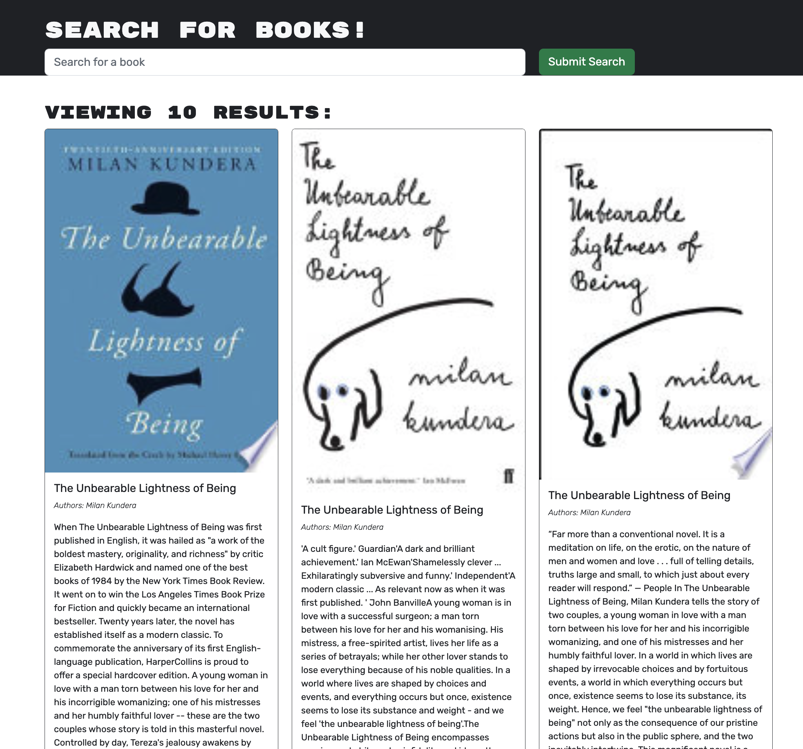
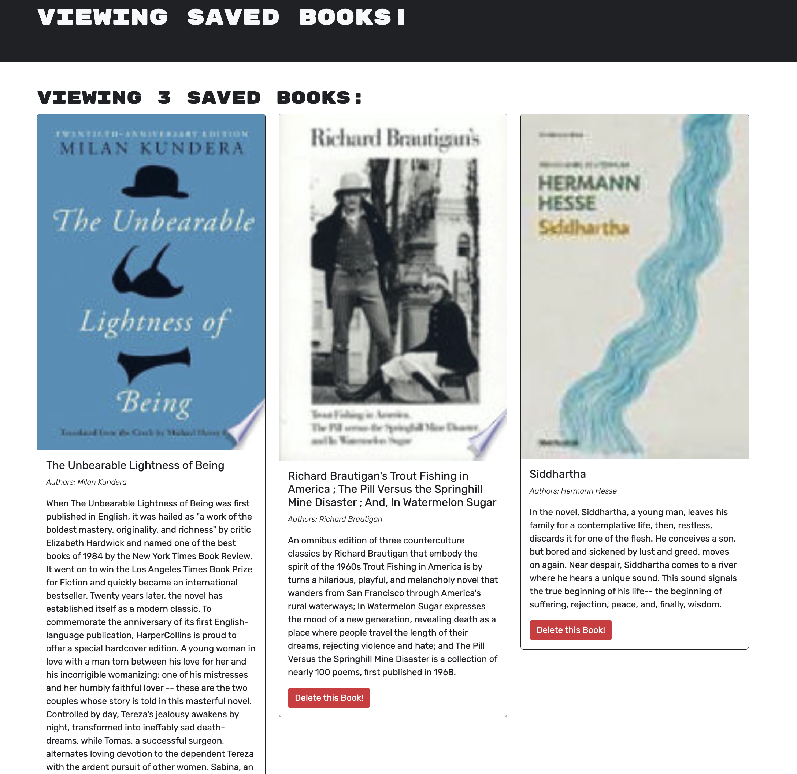

# MERN Google Book Search

## Description

This app searches Google's Book API, allowing users to save individual books to their personal profile. I've refactored the code to use GraphQL instead of RESTful routes.

The process was not very straightforward as there are many interconnected pieces when it comes to querying or mutating the database, with multiple pieces interacting on the front and back end.

I also learned more about deploying to Heroku, specifically making a connecting to Mongo Atlas and downgrading my node in my package.json using "engines".

## Installation

To run this code locally, run "npm i" and "npm run develop" in your CLI.

## Usage

This app is deployed at [https://fast-savannah-86254.herokuapp.com/
](https://fast-savannah-86254.herokuapp.com/).

Users can search books without logging in, but to save them, one needs to create an account. User can delete books they saved from their profile page.

Here's a screenshot of search results:

Here's a screenshot of a user's profile showing their saved books:

## Credits

I had lots of debugging help from askBCS on this project. They weren't always able to completely solve my problem, but having another mind to think with helped me better undestand my code.
